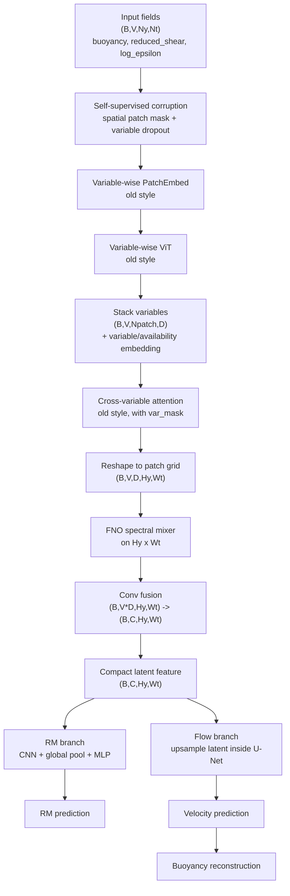

# SharedFNO RM + flow pipeline

This is the preferred hybrid after keeping the old encoder style but shrinking the latent representation.

Default shape with `kh_holmboe_dataset_keep_epsilon.h5`, `patch_size=(10,10)`, and `latent_channels=64`:

`input: (B,3,491,200) -> compact latent: (B,64,50,20)`

This keeps the old encoder logic but avoids the old high-resolution encoder output:

`old final feature: (B,64,491,200)`

The compact latent is about 1 percent of the old final feature by element count.
